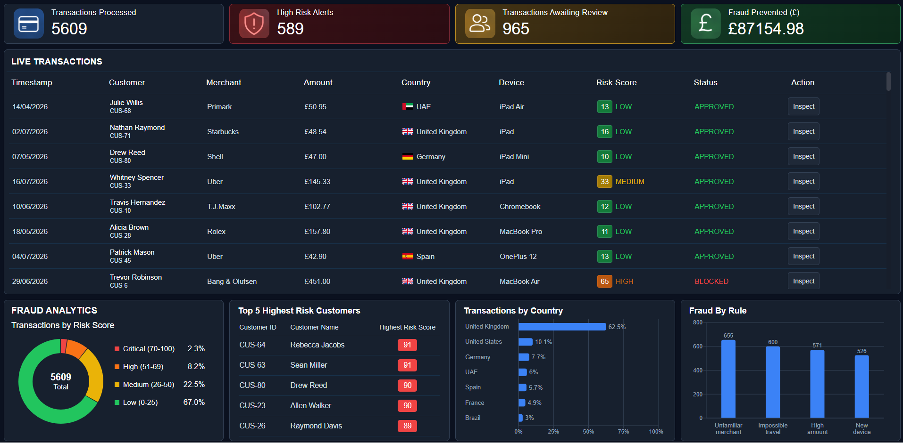
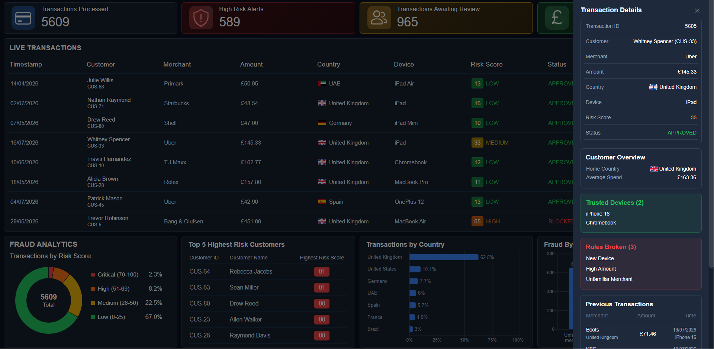

### Overview

A full-stack fraud detection platform built using Python Flask, PostgreSQL, and React. The platform simulates realistic banking customers and transaction activity, applies rule-based fraud detection to score transactions in real time, and presents the results through an interactive analytics dashboard. Analysts can investigate suspicious activity, review customer profiles and historical transactions, and approve or block flagged transactions directly from the interface.

---

### Preview

#### Main Dashboard UI

#### Slide Window UI

---

### Features

- **Live Transactions Feed** — a continuously updating table of transactions with risk score and status badges
- **Fraud Detection Engine** — every transaction is scored against a set of rule-based checks (new device, high amount, impossible travel, unfamiliar merchant), producing a risk score, risk level, and status
- **Fraud Analytics** — a donut chart breaking down transactions by risk score band (Low / Medium / High / Critical)
- **Top 5 Highest Risk Customers** — ranked list of the riskiest customers by their highest recorded risk score
- **Transactions by Country** — horizontal bar chart showing the geographic distribution of transactions
- **Fraud by Rule** — bar chart showing how often each individual fraud rule is triggered across all alerts
- **Transaction Inspection Panel** — a slide-out side panel showing full transaction details, a customer overview (home country, average spend), the customer's trusted devices, the specific rules broken on that transaction, and their 5 most recent transactions
- **Approve / Decline Actions** — analysts can action a flagged transaction directly from the side panel, updating its status in the database

---

### How It Works

1. **Customer generation** — `customerGenerator` creates a pool of synthetic customers (Standard / Premium / Business account types), each assigned a home country and account status using weighted probabilities.
2. **Profile building** — `TransactionGenerator.build_profiles()` builds an in-memory spending profile per customer (average spend, favourite merchants, 2 trusted devices), and persists the trusted devices to the `Customer` table.
3. **Transaction generation** — each transaction is generated as one of three types:
   - **Normal** — matches the customer's usual spending pattern
   - **Suspicious** — breaks exactly one fraud rule
   - **Fraudulent** — breaks two or more fraud rules at once
4. **Live simulation** — `LiveTransactionGenerator` continuously creates a new transaction for a random customer every few seconds, simulating a live feed.
5. **Fraud scoring** — `FraudDetectionEngine.score_transaction()` checks each transaction against the customer's profile:
   - Is the device untrusted? → **New Device**
   - Is the amount over 2.5x the customer's average? → **High Amount**
   - Is the transaction in a different country to the customer's home country? → **Impossible Travel**
   - Is the merchant outside the customer's usual favourites? → **Unfamiliar Merchant**
     Each triggered rule adds to a cumulative risk score, which is capped at 100 and mapped to a risk level (`LOW` / `MEDIUM` / `HIGH` / `CRITICAL`) and a status (`APPROVED` / `REVIEW` / `BLOCKED`).
6. **Alerting** — if a transaction ends up under review or blocked, an `Alert` record is created storing which specific rules were broken.
7. **Analytics** — `AnalyticsEngine` aggregates this data for the dashboard: totals, risk distribution, riskiest customers, country breakdown, and rule-trigger counts.

---

### API Endpoints

| Method | Endpoint                                      | Description                                  |
| ------ | --------------------------------------------- | -------------------------------------------- |
| GET    | `/api/live-transactions`                      | Most recent live transactions                |
| GET    | `/api/analytics/total-transactions`           | Total transaction count                      |
| GET    | `/api/analytics/high-risk-alerts`             | Count of HIGH/CRITICAL risk transactions     |
| GET    | `/api/analytics/transactions-awaiting-review` | Count of transactions with status `REVIEW`   |
| GET    | `/api/analytics/fraud-prevented`              | Total value (£) of BLOCKED transactions      |
| GET    | `/api/analytics/transactions-by-risk`         | Transaction counts grouped by risk level     |
| GET    | `/api/analytics/riskiest-customers`           | Top 5 customers by highest risk score        |
| GET    | `/api/analytics/transactions-by-country`      | Transaction counts grouped by country        |
| GET    | `/api/analytics/fraud-by-rule`                | Count of times each fraud rule was triggered |
| GET    | `/api/customers/<id>/recent-transactions`     | Last 5 transactions for a customer           |
| GET    | `/api/customers/<id>/profile`                 | Home country, trusted devices, average spend |
| GET    | `/api/transactions/<id>/alerts`               | Rules broken for a specific transaction      |
| PATCH  | `/api/transactions/<id>/approve`              | Mark a transaction as approved               |
| PATCH  | `/api/transactions/<id>/block`                | Mark a transaction as blocked                |

---

### Tech Stack

**Backend**

- Python, Flask, Flask-CORS
- SQLAlchemy (ORM)
- PostgreSQL

**Frontend**

- React (Vite)
- Recharts (data visualisation)
- Plain CSS

**Data Generation**

- Faker for synthetic identities
- Custom weighted-random generators for transactions, merchants, devices and countries
