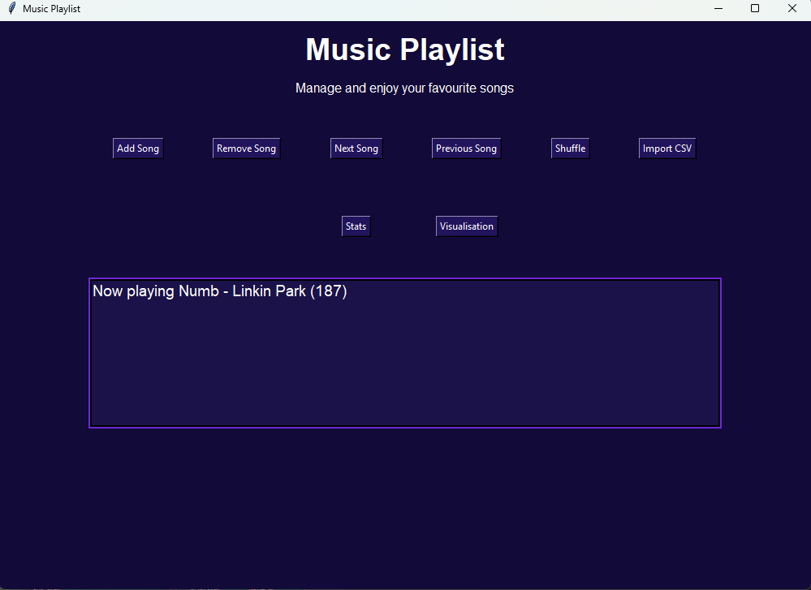
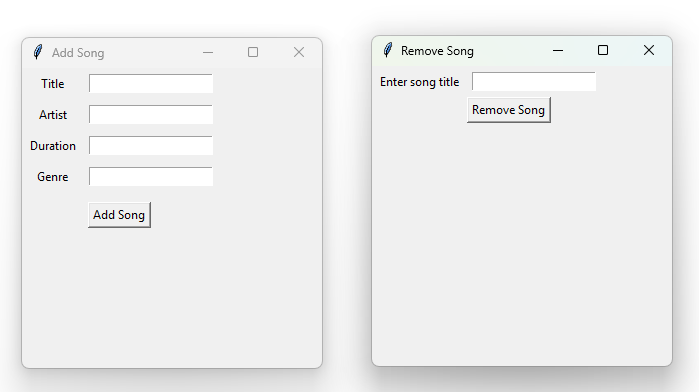
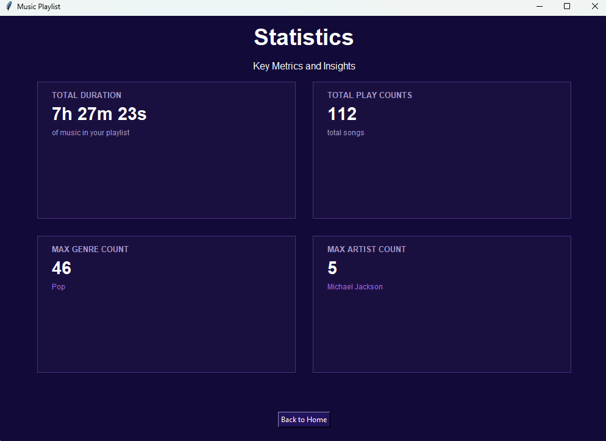
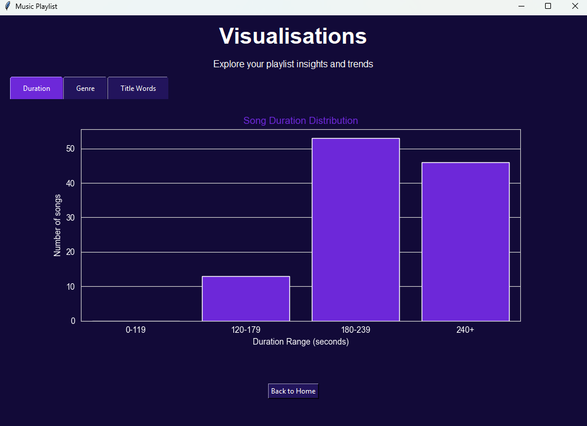

### Overview

A Python-based music playlist manager with a graphical user interface built using Tkinter. Users can manage and interact with their music collection through playlist, navigation, song management, statistical analysis, data visualisation and CSV-based importing, implemented through a doubly linked list data structure.

### Features

- Add and remove songs from a playlist
- Navigate between songs (next, previous)
- Shuffle the playlist randomly
- Track playlist statistics (Total duration, playcount, top genre, top artist)
- Generate visualisations (Song duration distribution, genre distribution, most common words in song titles)
- Import ready made playlist from a CSV file

### Data Structures & Concepts

- Doubly linked list for playlist management
- Data analysis (stats tracking)
- Data visualisation using matplotlib and seaborn
- GUI build with Tkinter (tabbed notebook layout, multiframe navigation, pop-up dialogues)
- File handling with CSV import

### How to Run

Project requres python installed (preferred: python 3.13)

Install Dependences:  
pip install matplotlib seaborn

Run program using:  
python GUI.py

Make sure your entered files exist at:  
Data/songs.csv

### GUI Overview

The application has 3 main screens:

**Home Screen**  
The main landing screen with buttons to:  
Add song - opens a pop-up to enter title, artist, duration and genre  
Remove song - opens a pop-up to remove a song by title  
Next/Previous song - navigate through the playlist  
Shuffle - randomise playlist order  
Import CSV - load data from a csv file  
Stats - navigates to the Statistics screen  
Visualistion - navigates to the Visaualisations screen

**Statistcs Screen**  
Displays 4 metric cards:

- Total Duration of playlist
- Total Play Count (number of songs)
- Max Genre Count (most represented genre)
- Max Artist Count (most represented artist)

**Visualisations Screen**  
A tabbed view with three charts:

- Duration - bar chart of song duration distribution
- Genre - bar chart of songs per genre
- Title Words - bar chart of most common words in song titles

### Key Components

**SongNode (song_node.py)**  
Represents each song with:

- Title
- Artist
- Duration
- Genre

**Playlist (playlist.py)**  
Manages songs using a doubly linked list  
Handles:

- Navigation (next, prev song)
- Add & Remove song
- Shuffle playlist
- Import from CSV file

**Stats (stats.py)**  
Tracks:

- Total duration
- Play counts
- Genre distribution
- Artist distribution

**Graphs (graphs.py)**  
Generates visual insights using Matplotlib and Seaborn charts

**GUI (GUI.py)**  
Tkinter-based interface with multi-frame navigation, tabbed visualisations and pop-up confirmations

### Limitations

Limitations include:

- Fixed CSV file path (data/songs.csv)
- Data is lost upon refresh and must be re-imported from CSV File
- Users cannot search, sort, or filter songs within playlist
