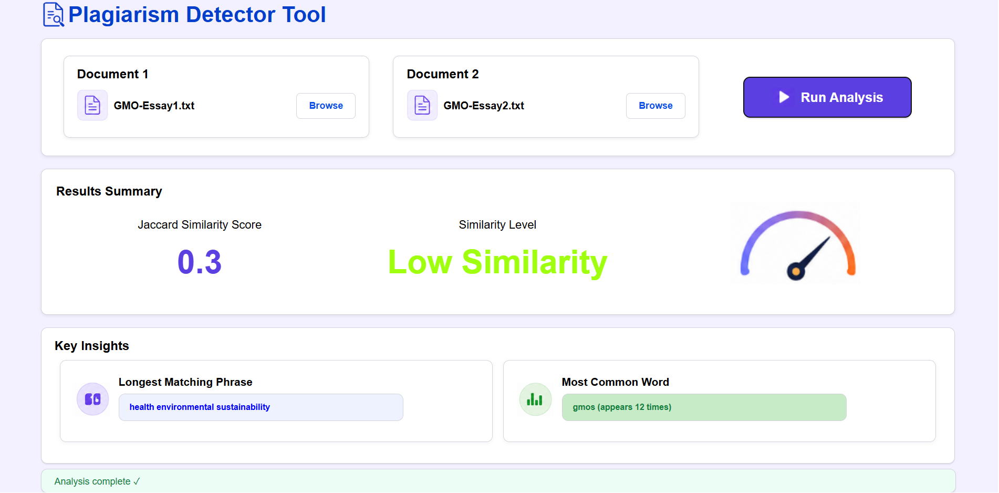

### Overview

A web-based plagiarism detection tool with a React frontend and Flask backend that compares two text documents by using text-preprocessing, k-gram phrase matching, Jaccard Similarity, and frequency based analysis.

### Preview

### How it works

**Preprocessing (preprocess.py)**  
Cleans text by converting to lower case letters, removing punctuation and excess whitespace  
Tokenises texts into words  
Removes stop words (e.g. a, the, then, is)

**Generates k grams (kgrams.py)**  
Converts cleaned tokens into kgrams of length k (length of k=6 used)

**Similarity Calculation (similarity.py)**  
Converts tokens into sets and finds similarity through Jaccard Similarity  
Returns a labelled similarity score:

- Very Low
- Low
- Moderate
- High
- Very High

**Analysis (analysis.py)**  
Finds longest copied phrase utilising sets for fast lookup (O(n))  
Finds most common phrase by using Counter to track frequency and identify most repeated shared phrase

### Tech Stack

**React** - Frontend  
**Flask** - Backend

### Limitations

Limitations include:

- Only detects exact matches
- Fixed k-gram size (Currently k=3)
- Only allows .txt files

Cannot detect:

- Paraphrasing
- Synonyms
- Reorded Setences
